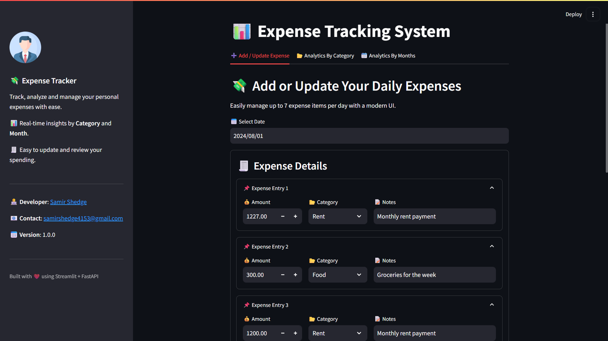
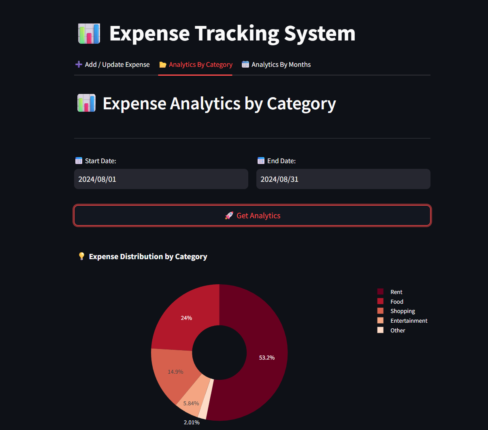
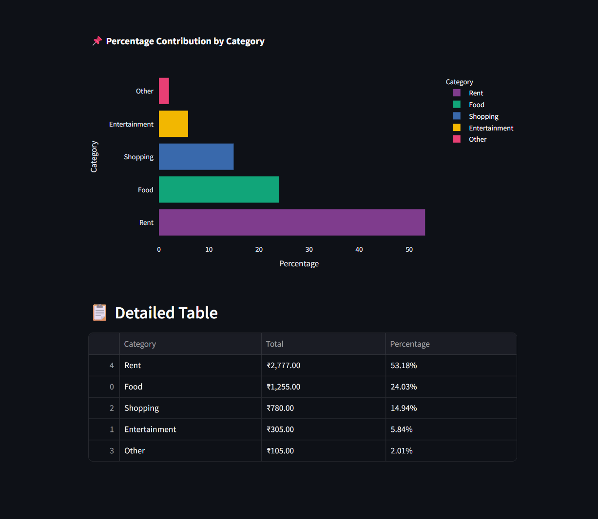
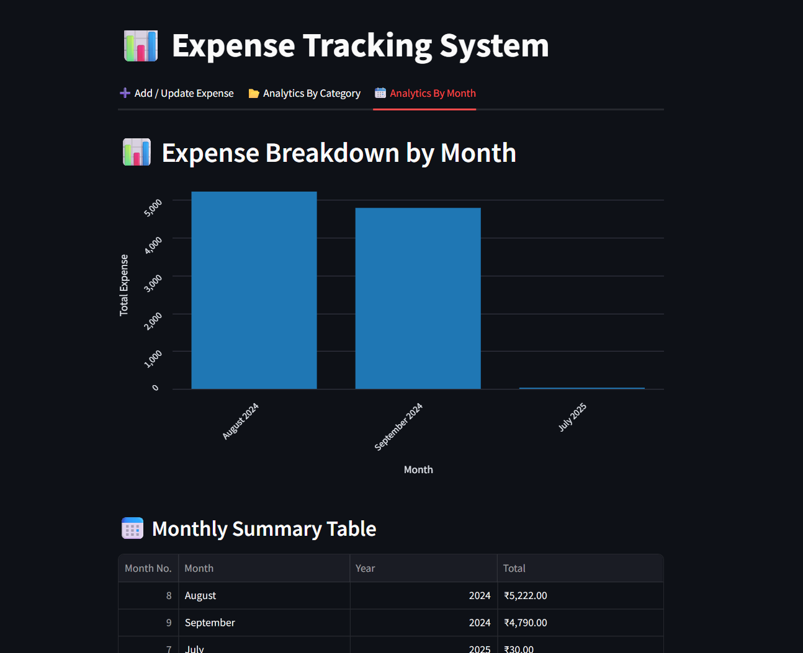

# 💰 Expense Management System


This project is a full-stack Python-based Expense Management System that uses **FastAPI** for the backend and **Streamlit** for the frontend.

📌 **Note:**  
This project is **not deployed** and is created for **learning purposes only**.  
If anyone wants to run this project locally on their computer, follow the setup instructions below.


## ✅ Features

- Add and update expense records
- View monthly and category-based analytics
- Clean and interactive UI with Streamlit
- Fast and simple REST API using FastAPI
- Log tracking with server.log


## ⚙️ Tech Stack

- 🐍 **Python** with **FastAPI** for backend API development
- 🌐 **Streamlit** for building an interactive and user-friendly frontend interface
- 🐬 **MySQL** for storing and managing expense data


## 📁 Project Structure

```
project-expense-tracking/
│
├── assets/                   # UI screenshots
│   ├── add_update_ui.png
│   ├── analytics_view1.png
│   ├── analytics_view2.png
│   └── analytics_view3.png
│
├── backend/                  # FastAPI backend server code
│   ├── db_helper.py
│   ├── logging_setup.py
│   ├── server.py
│   └── server.log
│
├── database/                 # Database schema
│   └── expense_db_creation.sql
│
├── frontend/                 # Streamlit frontend code
│   ├── add_update_ui.py
│   ├── analytics_by_category.py
│   ├── analytics_by_months.py
│   └── streamlit_app.py
│
├── tests/                    # Test cases for backend & frontend
├── requirements.txt          # Python package requirements
└── README.md                 # Project overview and instructions
```

---

##  🚀 How to Run Locally / Setup Instruction

### Prerequisites  
- Python 3.8+

### 1. Clone the Repository

```bash
git clone https://github.com/Samir-Shedge/Expense-Tracking-System
cd expense-management-system
```

### 2. Install Dependencies

```bash
pip install -r requirements.txt
```

### 3. Run the FastAPI Backend Server

```bash
uvicorn backend.server:app --reload
```

### 4. Run the Streamlit Frontend App

```bash
streamlit run frontend/streamlit_app.py
```


---

## 🔌 API Endpoints

| Method | Endpoint         | Description                |
| ------ | ---------------- | -------------------------- |
| GET    | `/expenses/`     | Fetch all expenses         |
| POST   | `/expenses/`     | Add a new expense          |
| PUT    | `/expenses/{id}` | Update an existing expense |
| DELETE | `/expenses/{id}` | Delete an expense          |

---
## 🧪 Testing
To run test cases:

```bash
pytest tests/
```

---

## 📸 Screenshots

### 🔹🏠 Home Page - Add_Update Expense UI


### 🔹📊 Analytics View - Monthly Expenses


### 🔹🧾 Analytics View - Category Breakdown


### 🔹💰 Analytics View - Chart Summary


---

## 📂 Requirements

All dependencies are listed in `requirements.txt`. Make sure to use Python 3.8+.

## 🙌 Acknowledgements

- FastAPI
- Streamlit
- MySQL
- Codebasics.io

## 📫 Contact

Made with ❤️ by **Samir Shedge**  
📧 Email: [samirshedge4153@gmail.com](mailto:samirshedge4153@gmail.com)  
🔗 LinkedIn: [samir-shedge-9b487327a](https://www.linkedin.com/in/samir-shedge-9b487327a)

---
